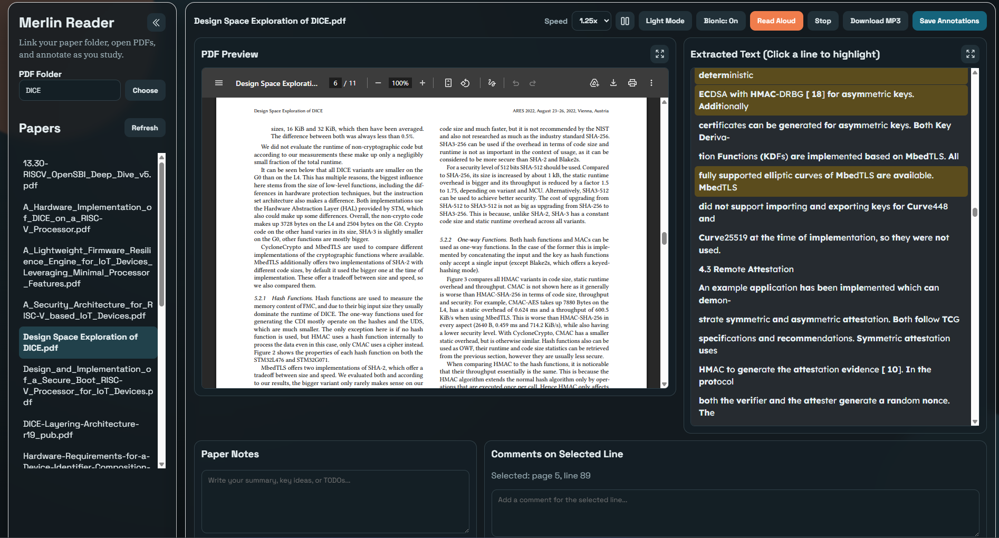
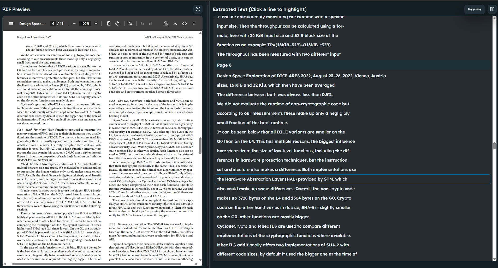
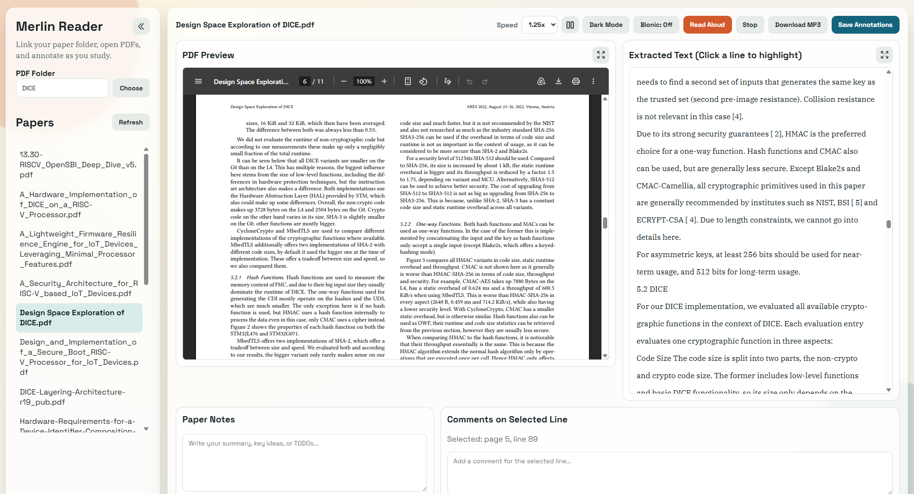
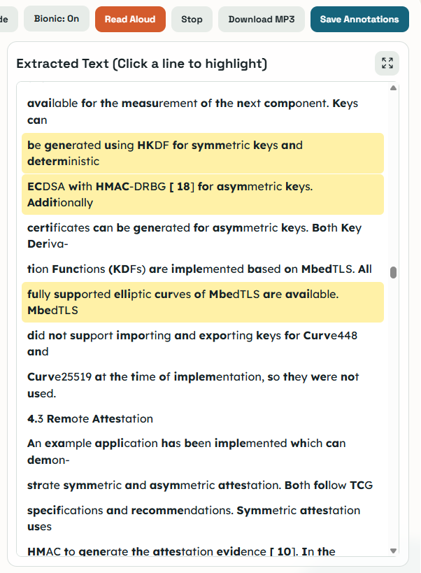

# Merlin Paper Reader

Flask web app for reading papers from a linked folder, listening to extracted text, and saving study annotations.

## Screenshots

| Main View | Focus Split View |
| --- | --- |
|  |  |

| Dark Mode / Light Mode | Bionic Reading |
| --- | --- |
|  |  |


## Features

- Link any local folder that contains `.pdf` files.
- Use modern browser folder selection via `showDirectoryPicker` (Choose button).
- Browse and open papers from the linked folder.
- Preview each PDF in-app.
- Extract and display text page-by-page.
- Read papers aloud with browser text-to-speech.
- Pause and resume reading from the focus split view.
- Click text lines to highlight them.
- Add comments tied to specific page/line selections.
- Keep free-form notes per paper.
- Save highlights/comments/notes to local JSON storage.
- Create MP3 files from your papers.
- Use a focus split view for side-by-side PDF preview and extracted text.
- Toggle bionic reading for faster scanning.
- Switch between dark mode and light mode.

## Quick Start

1. Create and activate a Python virtual environment:

```bash
python3 -m venv .venv
source .venv/bin/activate
```

2. Install dependencies:

```bash
pip install -r requirements.txt
```

3. Start the app:

```bash
python app.py
```

4. Open your browser at:

```text
http://127.0.0.1:5000
```

## Data Storage

- Linked folder path is stored in `data/settings.json`.
- Paper notes, highlights, and comments are stored in `data/annotations.json`.

## Notes

- Text extraction quality depends on whether the PDF has selectable text.
- Scanned/image-only PDFs may return little or no text unless OCR is applied beforehand.
- Browser folder picking works best in Chromium-based browsers that support the File System Access API.
